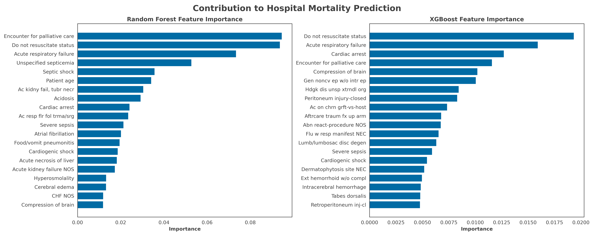

# Data Leakage Plagues Predictive Artificial Intelligence Literature in Healthcare

Artificial intelligence (AI) is increasingly being applied to predict a wide variety of clinical outcomes, including in-hospital mortality. However, a fundamental oversight persists: many models use diagnostic (ICD) codes as features, despite these codes not being finalized until after the clinical encounter has ended (e.g. after hospital discharge).  This introduces data leakage of the outcome into the set of predictors (e.g. including the ICD code for cardiac arrest into an inpatient mortality prediction model); a severe methodological flaw that inflates performance metrics. The goal of this repository is to develop a model with features only of sex, age, and ICD codes to show strong correlation between ICD codes with mortality, presenting potential target leakage problem.  

Feel free to [Contact Us](mailto:mingchiehliu@uchicago.edu;beaulieujones@uchicago.edu;burkh4rt@uchicago.edu) if you have any questions or issues with the code.
Alternatively you can file a pull request or raise an issue on this repo.

## Setting up the Environment

### Create an environment
Python 3.10 or higher is required.

[Optional] We strongly encourage to use a virtual environment, for example Conda: To create a new conda env:
```bash
conda create --name data-leakage python=3.10
conda activate data-leakage
```

### Install dependencies

Git clone the repo and install dependencies with the `requirements.txt`:
```bash
git clone https://github.com/bbj-lab/data-leakage.git
cd data-leakage
pip install -r requirements.txt
```

### Setting up MIMIC-IV database 

MIMIC data is public available: https://physionet.org/content/mimiciv/2.2/ (require free online course training). In this study, version 2.2 of MIMIC-IV is used. 

Build the MIMIC database with sharing repo https://github.com/MIT-LCP/mimic-code/tree/main/mimic-iv by following instructions in `buildmimic` and `concepts`. [Optional] It is highly suggested to use PostgreSQL to build database. 

## Model training and testing

We provide the following resources for reproducing the results from our paper (requires Google Account):
* the intermediate tables from MIMIC-IV database at Google Drive (TODO)
* the trained models at Google Drive (TODO)

Main codes are in `data-leakage/notebooks/`. Run the notebook from scratch as follows:
1. Check `creds.json`: it contains the credentials for connecting MIMIC-IV database. 
2. Execute `icd_model.ipynb`. 

It is suggested to have at least 128GB memory to run the whole notebook. 

## Results

### AUROCs for the models 


### Logistics regression top 10 features

Top 10 significant features sorted by odds ratios (OR) for the logistics regression model. 

| Top 10 features with the highest odds ratios    |   OR    |     95% CI     | Adjusted p-value <br> after BH procedure |
|------------------------------------------------ |:-------:|:--------------:|:-----------------------------------:|
| Subdural hem-deep coma                          |  900.71 | 43.22—18770.62 |              < 0.001                |
| Brain death                                     |  783.36 | 32.93—18637.79 |              < 0.001                |
| Cardiac arrest                                  |  220.00 | 160.40—301.75  |              < 0.001                |
| Transient visual loss                           |  102.86 | 49.18—215.15   |              < 0.001                |
| Encounter for palliative care                   |  95.29  | 80.90—112.24   |              < 0.001                |
| Chronic nephritis NOS                           |  71.51  | 31.86—160.48   |              < 0.001                |
| Renal sclerosis, unspecified                    |  54.65  | 34.41—86.79    |              < 0.001                |
| Patient age                                     |  39.13  | 35.43—43.22    |              < 0.001                |
| Chronic osteomyelitis, pelvic region and thigh  |  37.90  | 18.10—79.35    |              < 0.001                |
| Benign neoplasm of duodenum, jejunum, and ileum |  31.15  | 18.03—53.84    |              < 0.001                |

### Random forest and XGBoost top features 

Top 20 feature importances for the random forest and XGBoost models. **Note:** Feature importance does not imply the direction in predictions. 



## Notes

- All of our experiments were run on computers with single or multiple CPUs.
- All of our experiments were run on computers running Linux.
- If you have questions, please do not hesitate to [Contact Us](mailto:mingchiehliu@uchicago.edu;beaulieujones@uchicago.edu;burkh4rt@uchicago.edu). 